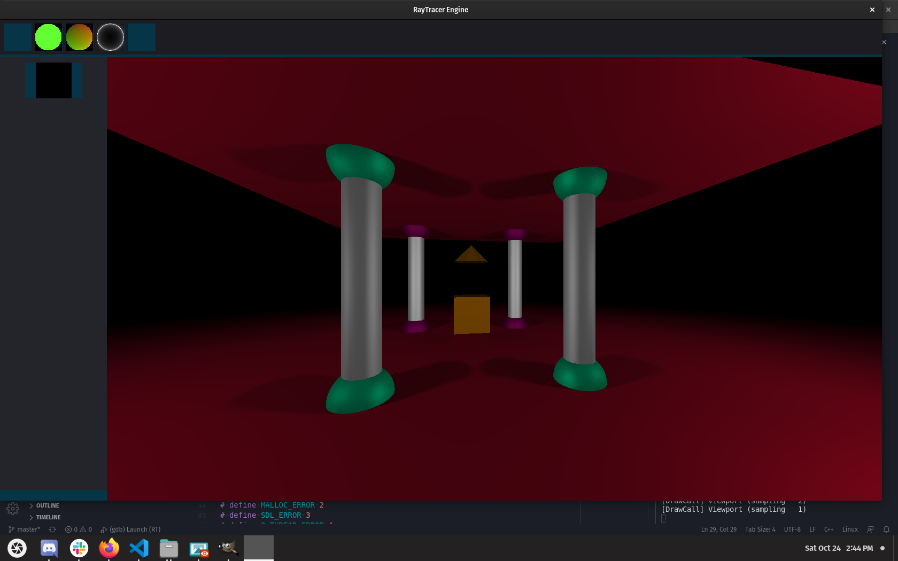
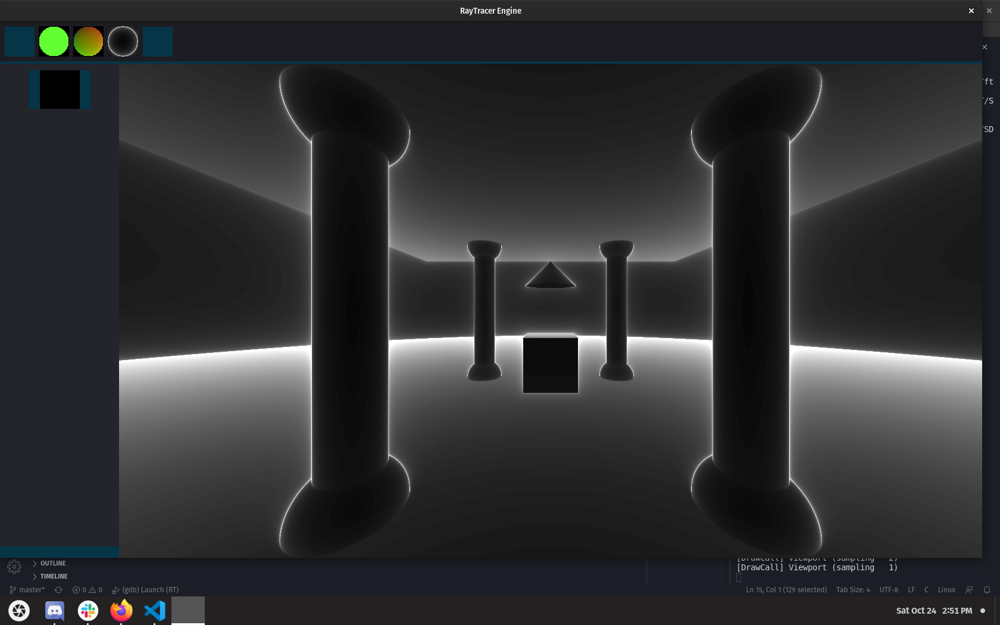

# RayTracerEngine

Extension of a 42 school project, how you should create a basic raytracing renderer.
I decide to make more feature like interface, 3D fractals and maps savers.
I want to any people downloading this repo can easy create realistique images/videos with RayMarching algorithm. 

## Project [road map](https://trello.com/b/o3UnSwg7/ray-tracer-engine) on Trello

## Current look like




## Install
  SDL2 Installation
```
  $ cd SDL2
  $ ./configure
  $ make
  $ sudo make install
```
  Some error could be happend here SDL need some dependency, maybe I gonna explain all things to do
  but I currently do not understand every thing so you can search on google :D sry
##  Launch
```
  $ make && ./rt
```
  If you want to open a map already saved find the .rt file of your map and specified the file in your command
```
  $ make && ./rt directory/maps.rt
```
