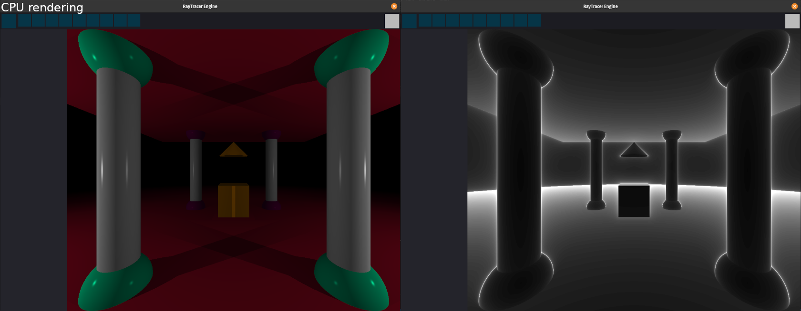
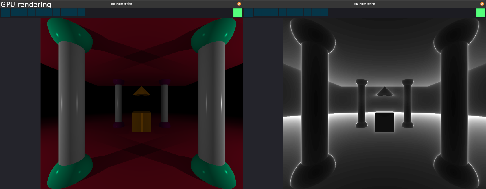

# RayTracerEngine

Extension of a 42 school project, how you should create a basic raytracing renderer.
I decide to make more feature like interface, 3D fractals and maps savers.
I want to any people downloading this repo can easy create realistique images/videos with RayMarching algorithm.

## Project [road map](https://trello.com/b/o3UnSwg7) on Trello

## Current look like

Time: ~2s for each image

Time: ~0.5s for each image


## Install
  SDL2 Installation
```
  $ cd SDL2
  $ ./configure
  $ make
  $ sudo make install
```
  SDL should be installed now, but if you have issue look SDL dependecy at google (Hope you'll find a way)
  
  OpenCL Installation
```
  $ sudo apt-get install ocl-icd-opencl-dev
```

##  Launch
```
  $ make && ./rt
```
  If you want to open a map already saved find the .rt file of your map and specified the file in your command
```
  $ make && ./rt directory/maps.rt
```
